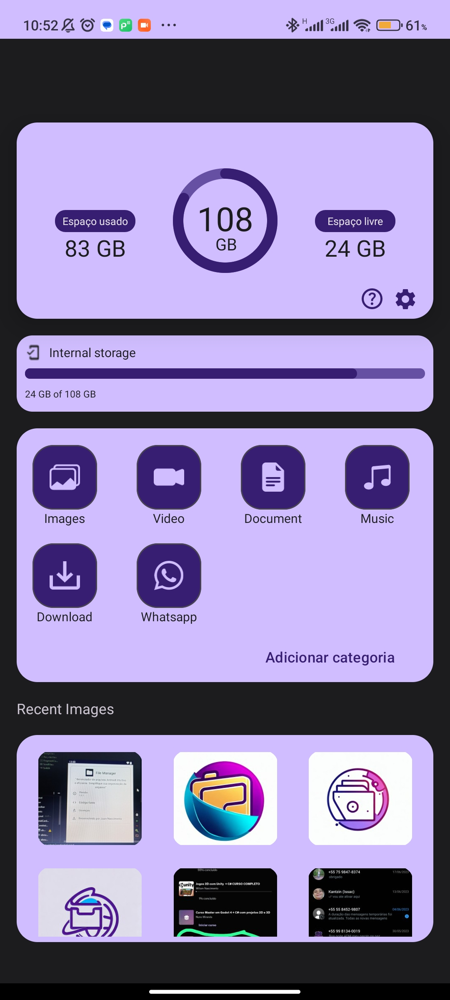
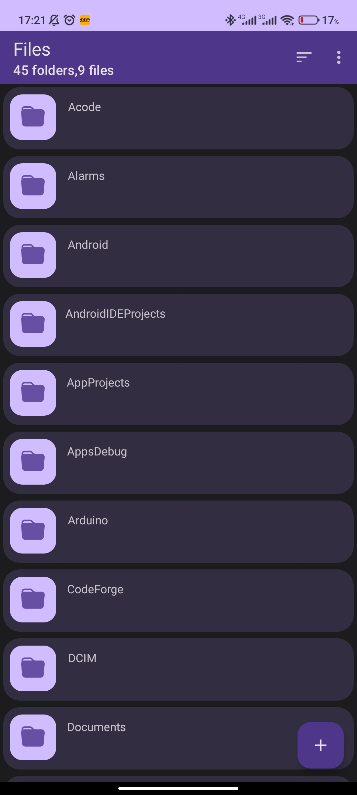
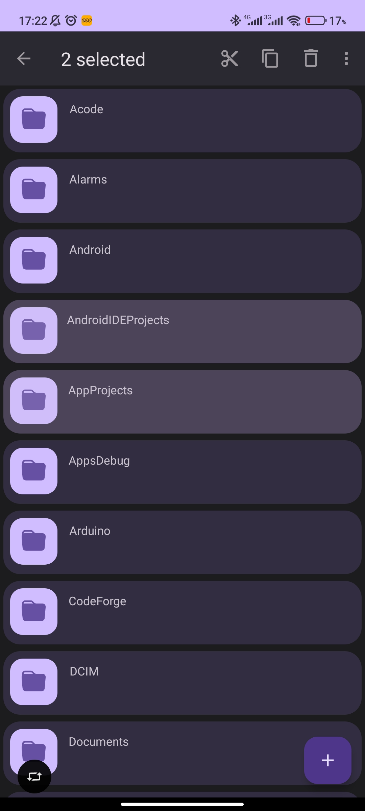
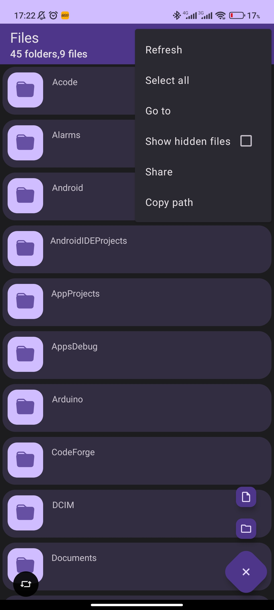
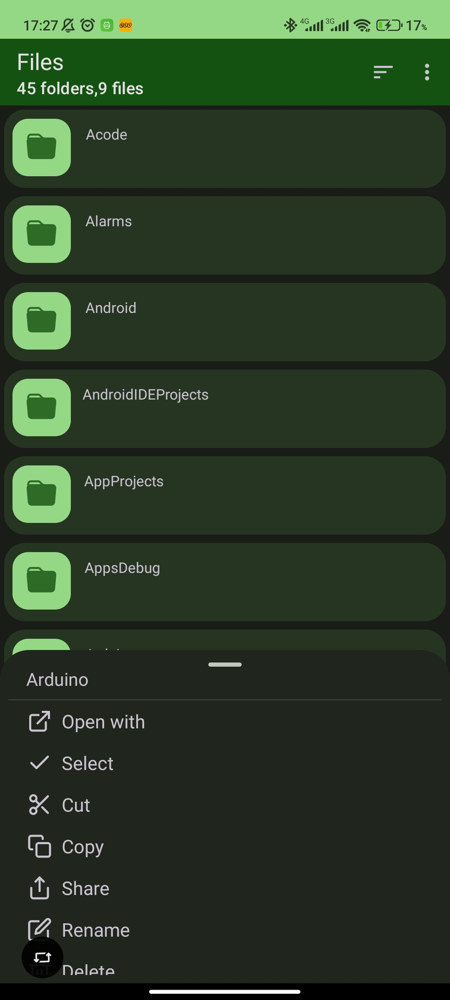
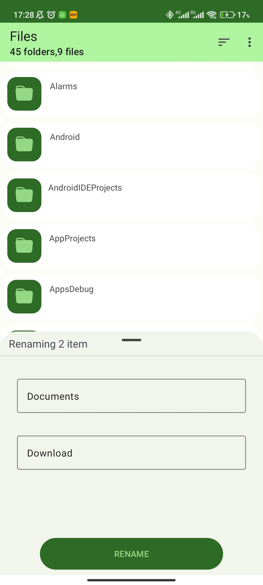
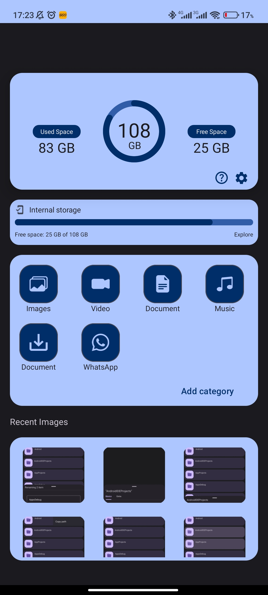
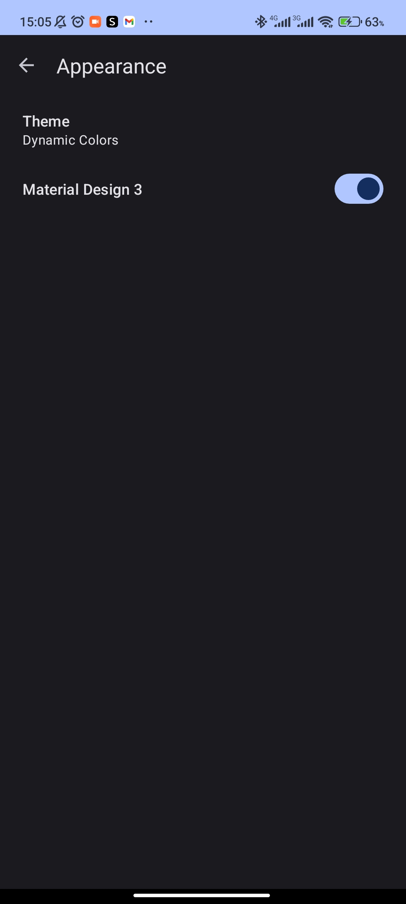
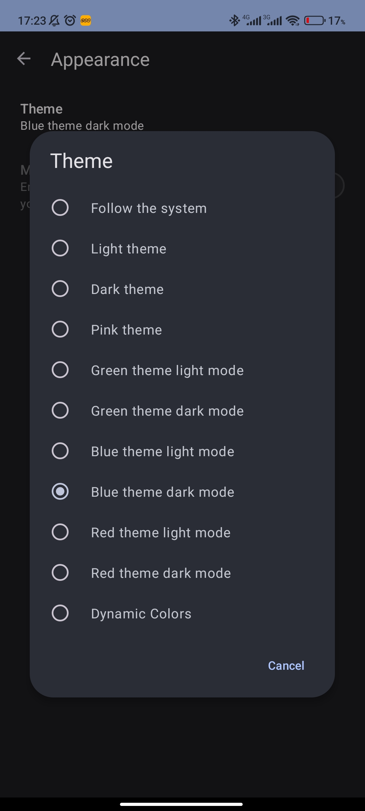

<h1 align="center"><b>FileManagerSphere</b></h1>
<b>FileManagerSphere</b>, a customizable and modern file manager

 </a>
  </a>
  </a>
   
   
    
    
    
     
    
       

---                 

## What is FileMangerSphere?
 

    
    
    

    
View More Screenshots

    

        
        
        
    

    

        
        
        
    

    

        
    

FileManagerSphere is a powerful file management tool, designed to simplify and enhance your experience when dealing with documents, media, and other file types. With advanced features and an intuitive interface, FileManagerSphere provides a comprehensive solution for organizing, browsing, searching, and manipulating your files with ease.   

---

## Features

- **Open-source:** Lightweight, clean, and secure.
- **Material Design:** Follows Material Design guidelines, with attention to detail.
- **File Support:** View, extract, and create common compressed files.
- **Themes:** Customizable user interface colors, along with optional true black dark mode.
- **Well-implemented:** Built on the right foundations, including Java NIO File API and LiveData.

---
  
## Key Features

- **Efficient Organization:** FileManagerSphere allows you to create folders, rename multiple files, and move files quickly and easily. Keep your documents and multimedia files well-organized for easy access and retrieval.

- **Intuitive Navigation:** With a user-friendly and intuitive interface, FileManagerSphere makes navigating between folders and files a breeze. Quickly find what you need and efficiently browse through your file structure.

- **Advanced Search:** Easily locate files using advanced search features. Search by name, extension, or specific keywords to quickly find the file you're looking for.

- **File Manipulation:** FileManagerSphere offers various options for file manipulation. Copy, move, rename, and delete files with just a few clicks. You can also preview and edit files directly within the interface.

---

## Installation

> _Currently you can download FileManagerSphere in the following ways
._
> - [_GitHub Releases_](https://github.com/Ruan625Br/FileMangerSphere/releases)
> - [_GitHub Actions_](https://github.com/Ruan625Br/FileMangerSphere/actions)

          
           
 

---
## Translations

currently unavailable

---

## Contribution

Contributions are welcome! If you would like to improve FileManagerSphere, feel free to submit a pull request. Make sure to discuss your ideas first by opening an issue.

---

## Authors

- [@Ruan625Br](https://www.github.com/Ruan625Br)

---

## Love my work?

<a href='https://ko-fi.com/juannascimento' target='_blank'>

---

## License

    Copyright (C) 2023 Juan Nscimento

    This program is free software: you can redistribute it and/or modify
    it under the terms of the GNU General Public License as published by
    the Free Software Foundation, either version 3 of the License, or
    (at your option) any later version.

    This program is distributed in the hope that it will be useful,
    but WITHOUT ANY WARRANTY; without even the implied warranty of
    MERCHANTABILITY or FITNESS FOR A PARTICULAR PURPOSE.  See the
    GNU General Public License for more details.

    You should have received a copy of the GNU General Public License
    along with this program.  If not, see <https://www.gnu.org/licenses/>.
