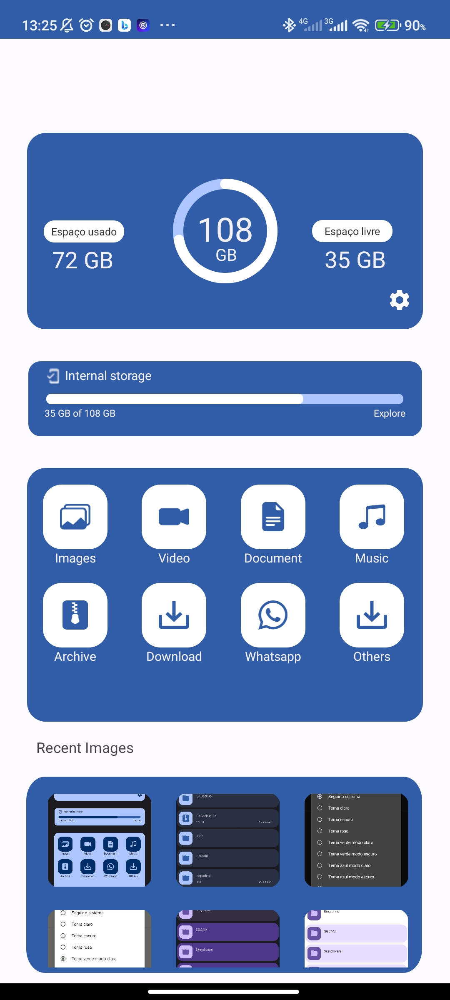
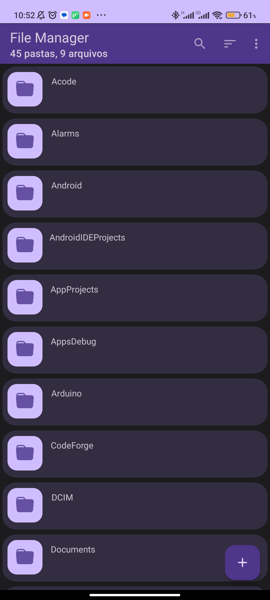

# FileManagerSphere
## EM CONSTRUÇÂO

Bem-vindo ao FileManagerSphere - seu gerenciador de arquivos personalizado!

## Preview

  
  

## Visão geral

O FileManagerSphere é uma poderosa ferramenta de gerenciamento de arquivos, projetada para simplificar e aprimorar sua experiência ao lidar com documentos, mídia e outros tipos de arquivos. Com recursos avançados e uma interface intuitiva, o FileManagerSphere oferece uma solução abrangente para organizar, navegar, buscar e manipular seus arquivos com facilidade.

## Características
   
- **Código aberto:** leve, limpo e seguro.
- **Design de Materiais:** Segue as diretrizes de Design de Materiais, com atenção aos detalhes.
- **Breadcrumbs:** Navegue no sistema de arquivos com facilidade.
- **Suporte a arquivos:** Visualize, extraia e crie arquivos compactados comuns.
- **Temas:** cores de interface do usuário personalizáveis, além do modo noturno com preto verdadeiro opcional.
- **Bem implementado:** Construído sobre as coisas certas, incluindo Java NIO2 File API e LiveData.

## Recursos Principais

- **Organização Eficiente**: O FileManagerSphere permite que você crie pastas, renomeie e mova arquivos de forma rápida e fácil. Mantenha seus documentos e arquivos multimídia bem organizados para facilitar o acesso e a localização.

- **Navegação Intuitiva**: Com uma interface amigável e intuitiva, o FileManagerSphere facilita a navegação entre pastas e arquivos. Encontre rapidamente o que você precisa e navegue de forma eficiente por sua estrutura de arquivos.

- **Busca Avançada**: Localize arquivos com facilidade usando recursos de busca avançados. Pesquise por nome, extensão ou palavras-chave específicas para encontrar rapidamente o arquivo que você está procurando.

- **Manipulação de Arquivos**: O FileManagerSphere oferece várias opções para manipular seus arquivos. Copie, mova, renomeie e exclua arquivos com apenas alguns cliques. Você também pode visualizar e editar arquivos diretamente na interface.

## Contribuição

Contribuições são bem-vindas! Se você quiser melhorar o FileManagerSphere, sinta-se à vontade para enviar um pull request. Certifique-se de discutir suas ideias primeiro, abrindo uma issue.

## Licença

Este projeto está licenciado sob a Licença [MIT](link_para_licenca).
